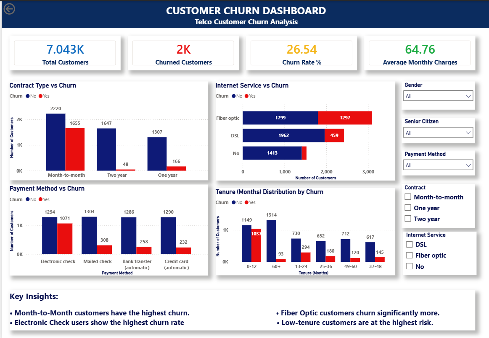

# Customer Churn Analysis

## Project Overview

This project analyzes customer churn behavior in a telecom company using SQL, Python, and Power BI.

The objective is to identify the key factors driving customer churn and provide business recommendations to improve customer retention.

---

## Business Problem

Customer churn directly impacts revenue and profitability.

This analysis answers the following questions:

1. What is the overall churn rate?
2. Which customer segments are most likely to churn?
3. Does contract type influence churn?
4. Does internet service type affect churn?
5. Which payment methods are associated with higher churn?
6. Which customers should be targeted for retention programs?

---

## Tools Used

- SQL (MySQL)
- Python
  - Pandas
  - NumPy
  - Matplotlib
- Power BI
- GitHub

---

## Dataset

IBM Telco Customer Churn Dataset

### Dataset Size

- Rows: 7,043
- Columns: 21

---

## Key KPIs

| KPI | Value |
|------|------:|
| Total Customers | 7,043 |
| Churned Customers | 1,869 |
| Churn Rate | 26.58% |
| Average Monthly Charges | 64.76 |

---

## SQL Analysis Findings

### Contract Type Analysis

| Contract | Churn Rate |
|-----------|-----------:|
| Month-to-Month | 42.71% |
| One Year | 11.28% |
| Two Year | 2.85% |

### Key Finding

Customers on Month-to-Month contracts are approximately 15 times more likely to churn than customers on Two-Year contracts.

---

### Payment Method Analysis

| Payment Method | Churn Rate |
|----------------|-----------:|
| Electronic Check | 45.29% |
| Mailed Check | 19.20% |
| Bank Transfer (Automatic) | 16.73% |
| Credit Card (Automatic) | 15.25% |

### Key Finding

Electronic Check users show the highest churn risk.

---

### Internet Service Analysis

| Internet Service | Churn Rate |
|------------------|-----------:|
| Fiber Optic | 41.89% |
| DSL | 18.96% |
| No Internet | 7.40% |

### Key Finding

Fiber Optic customers have the highest churn rate.

---

## Python EDA Findings

### Customer Tenure Analysis

| Customer Status | Average Tenure |
|-----------------|---------------:|
| Retained | 37.57 Months |
| Churned | 17.98 Months |

### Key Finding

Customers with lower tenure are significantly more likely to churn.

---

### Revenue Impact Analysis

| Customer Status | Avg Monthly Charges |
|-----------------|--------------------:|
| Retained | 61.27 |
| Churned | 74.44 |

### Key Finding

The company is losing higher-value customers.

---

## Power BI Dashboard

### Dashboard Features

- KPI Cards
- Contract Type Analysis
- Internet Service Analysis
- Payment Method Analysis
- Tenure Distribution Analysis
- Interactive Filters and Slicers

---

## Key Business Recommendations

1. Encourage customers to move from Month-to-Month contracts to annual plans.
2. Promote AutoPay adoption to reduce churn.
3. Investigate customer satisfaction issues among Fiber Optic users.
4. Focus retention efforts on customers with tenure below 24 months.
5. Develop retention programs for high-value customers.

---

## Dashboard Screenshots

### Customer Churn Dashboard

---

## Author

Simran Sonawane

GitHub:
https://github.com/simransonawane24
